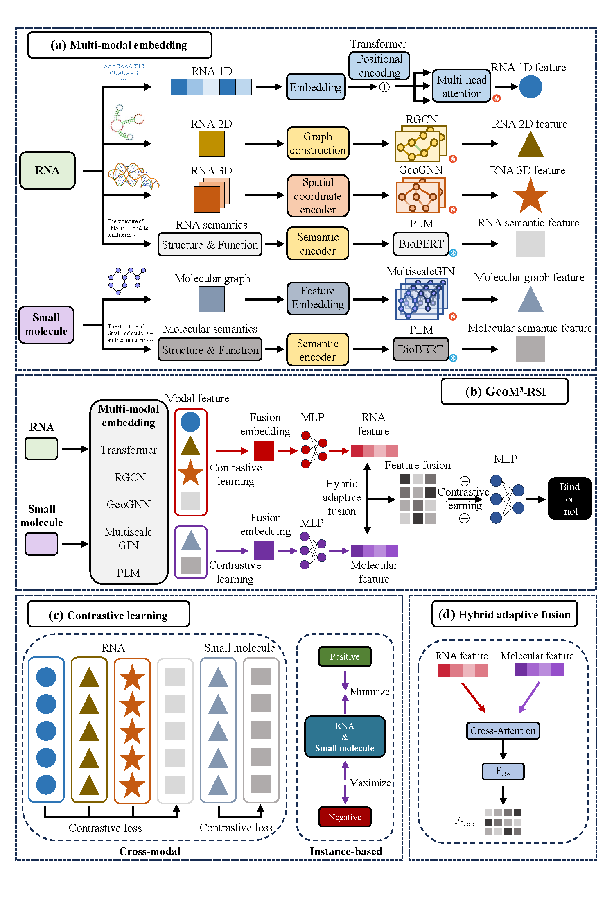

- # GeoM³-RSI

  This repository provides the PyTorch implementation of **GeoM³-RSI**, a geometry-aware multimodal information fusion framework for RNA–small molecule interaction prediction.

  GeoM³-RSI integrates RNA sequence information, RNA secondary-structure topology, predicted RNA tertiary geometry, small-molecule graph representations, and semantic textual embeddings within a unified multimodal learning architecture. The model uses modality-specific encoders, hybrid adaptive fusion, cross-entity attention, and contrastive learning to capture complementary structural, chemical, geometric, and semantic evidence for RNA–small molecule interaction prediction.

  * 

  # Requirements

  Recommended environment:

  * Python >= 3.10
  * PyTorch >= 2.0
  * PyTorch Geometric
  * RDKit
  * transformers
  * scikit-learn
  * pandas
  * numpy
  * tqdm
  * networkx
  * biopython
  * openpyxl

  The dependencies can be installed manually, for example:

  ```bash
  pip install torch torchvision torchaudio
  pip install torch-geometric
  pip install rdkit
  pip install transformers scikit-learn pandas numpy tqdm networkx biopython openpyxl
  ```

  If a `requirements.txt` file is provided, the dependencies can also be installed by:

  ```bash
  pip install -r requirements.txt
  ```

  # Repository Structure

  ```text
  GeoM3-RSI/
  ├── training.py          # Main training and evaluation script
  ├── model.py             # Model architecture and loss functions
  ├── create_data.py       # Data splitting and offline multimodal preprocessing
  ├── utils.py             # Utility functions for graph construction, metrics, and reproducibility
  ├── data/
  │   ├── 3D/
  │   │   └── alphafold3/
  │   │       ├── RNA.xlsx
  │   │       ├── Molecule.xlsx
  │   │       ├── RNA-Molecule.xlsx
  │   │       └── PDB/
  │   │           ├── RNA_ID_1.pdb
  │   │           ├── RNA_ID_2.pdb
  │   │           └── ...
  │   └── processed/
  ├── pretrained_models/
  │   └── biobert-base-cased-v1.2/
  ├── model/
  └── result/
  ```

  # Data Format

  The input dataset should be placed under the `data/` directory. By default, the training script uses:

  ```text
  data/3D/alphafold3/
  ```

  Each dataset folder should contain the following files.

  ## RNA.xlsx

  Required columns:

  * `RNA_ID`
  * `1D Sequence`
  * `Dot bracket`

  * RNA information`

  ## Molecule.xlsx

  Required columns:

  * `Small molecule_ID` 
  * `SMILES` `

  * `Small molecule information`

  ## RNA-Molecule.xlsx

  Required columns:

  * `RNA_ID`
  * `Small molecule_ID` 
  * `label` 

  The interaction label should be binary:

  ```text
  0 = non-interaction
  1 = interaction
  ```

  ## PDB directory

  RNA 3D structures should be stored in the PDB directory specified by `--pdb_dir`.

  By default:

  ```text
  data/3D/alphafold3/PDB/
  ```

  Each PDB file should be named according to the corresponding RNA ID:

  ```text
  <RNA_ID>.pdb
  ```

  # Download of Pre-trained Model

  GeoM³-RSI uses a pre-trained language model to encode RNA and small-molecule semantic textual inputs.

  Download BioBERT and place it under:

  ```text
  https://huggingface.co/dmis-lab/biobert-base-cased-v1.2
  ```

  The default paths used by the training script are:

  ```text
  pretrained_models/biobert-base-cased-v1.2
  ```

  for both RNA and small-molecule semantic encoding.

  # Usage

  ## Training

  Train GeoM³-RSI with the default setting:

  ```bash
  python training.py
  ```

  * Input:

    - RNA sequence, secondary-structure, tertiary-structure, and semantic information files (`.xlsx` files)
    - Small-molecule SMILES, graph, and semantic textual information files (`.xlsx` files)
    - RNA–small molecule binary interaction labels (`0/1`) (`.xlsx` files)
    - Predicted RNA 3D structure files (`.pdb` files)
    - Pre-trained language model files for semantic embedding extraction

    Output:

    - Processed multimodal graph data files
    - Trained model weights (`.pt` files)
    - Fold-wise training, validation, and test results (`.csv` files)

  
